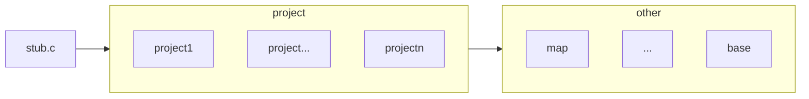

# 一、目的

该文件夹为源码文件夹，支持一套代码多个工程能力

# 二、架构

## 2.1 逻辑架构

src架构主要分三部分，如下图


### 2.1.1 stub.c文件

该文件为所有项目都会依赖的文件，主要是为了解决cmake的解耦依赖。当前为了保证cmake能够基于每个项目独立的cmake进行编译，使用了静态库的方式来暂时解决；而该方式需要一个可执行文件link静态文件，所以为了方便就先创建了一个空文件来作为入口可执行文件。如果后续能够找到更好地方案，则不再需要该文件

### 2.1.2 project

提供工程差异文件，工程的main.c入口也在这里面，每个工程需要提供如下文件和功能

```
略
```

### 2.1.3 other

提供公共的算法能力，其中包含 —— TODO

